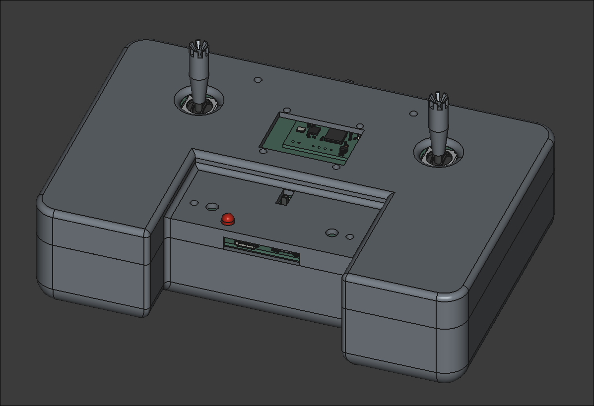
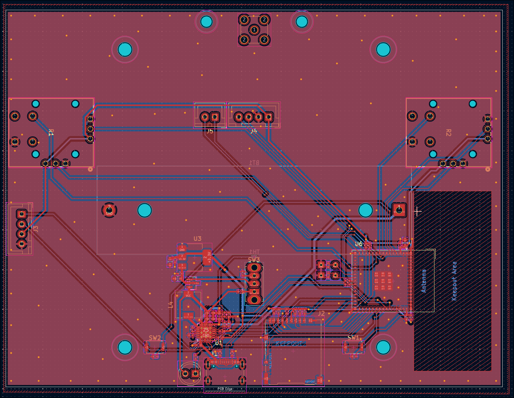
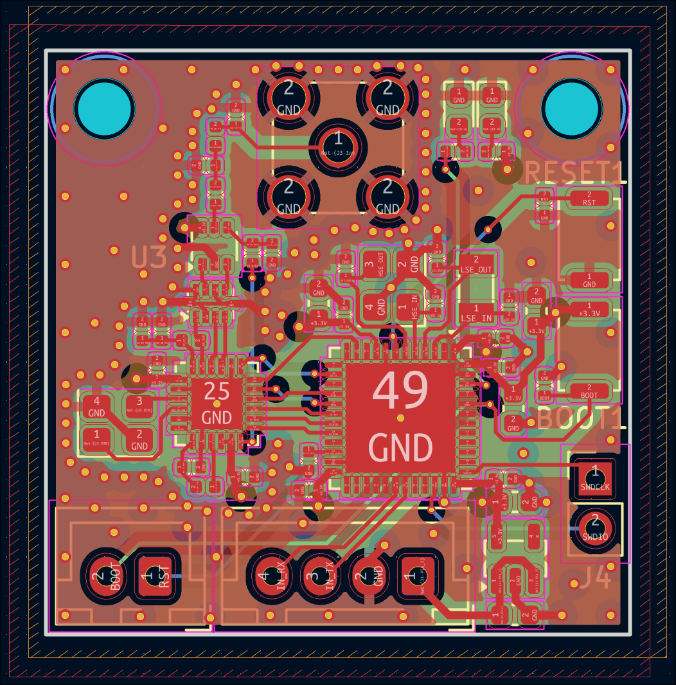

# Farsight RC

Custom long range remote controler with ESP32 to stream telemetry and an STM32 based lora module with the SX1262. The controller has a build in 18650 battery with an integrated charger. The transceiver is its own standalone board and can be used independenly of the controller. I made this project as a part of my larger goal to make a custom drone. I originaly was going to make it out of stock modules but decided to design custom pcbs.

## Usage

__--This is still under development and is subject to change--__

### Controller

The switch in the middle of the controller is the power switch and the led is the status of the battery charging. The usb connecter will charge the battery and can be used to communicate with the ESP32. The microsd card will log all the incoming telemetry.

The controller software is currently pretty basic and missing some fetures. The wifi network the esp32 will create can be configured by installing the espressive ide and running idf.py menuconfig and changing the wifi ssid and password under Wifi Configuration. Requesting /telemetry of the ip of the nextork will return a set of comma seperated values in the format of "altitude_meters,speed_meters_per_second,heading_degrees,latitude,longitude".

### Transceiver

UART pinout:
| 1   | 2   | 3  | 4  |
|-----|-----|----|----|
| VCC | GND | RX | TX |

Microcontroller pinout:
| 1     | 2    |
|-------|------|
| RESET | BOOT |

Debug pinout:
| 1      | 2     |
|--------|-------|
| SWDCLK | SWDIO |

The transciever has an internal regulator and can handle up to 5v input. The UART pinout is from the transceiver refrence so an external device would put its Tx to the transceiver Rx and vice versa. The buttons on the board will put the STM32 into boot and reset mode respectivly and the external pins are directly wired to the microcontroller. 

The transceiver is built on the [Semtech SX1262 driver](https://github.com/Lora-net/sx126x_driver). To communicate with the transceiver a host must first send a register bit and then the data to transmit or receive based on the table below.
| Address | Name                     | Description                        | Input/Output | Size | Note                                                                                                                                                                    |
|---------|--------------------------|------------------------------------|--------------|------|-------------------------------------------------------------------------------------------------------------------------------------------------------------------------|
| 0       | TX                       | Transmits packet                   | I            | 32   | Packet size must always be 32 bytes.                                                                                                                                    |
| 1       | RX                       | Receives packet                    | O            | 32   | Packet size must always be 32 bytes.                                                                                                                                    |
| 2       | TX_RX                    | Transmits then receives packet     | I/O          | 32   | Packet size must always be 32 bytes.                                                                                                                                    |
| 3       | sleep                    | Puts transceiver into sleep mode   | -            | 0    |                                                                                                                                                                         |
| 4       | wakeup                   | Wakes up transceiver               | -            | 0    |                                                                                                                                                                         |
| 5       | set_all                  | Inputs a setting struct            | I            | TBD  | See [settings_t](https://github.com/someonelse20/remote-controller/blob/main/software/transceiver/Core/Inc/uart_reg.h#L29)                                              |
| 6       | set_frequency            | Sets SX1262 frequency              | I            | 4    | See [sx126x_set_rf_freq](https://github.com/Lora-net/sx126x_driver/blob/master/src/sx126x.h#L1084)                                                                      |
| 7       | set_tx_params            | Sets SX1262 TX power and ramp time | I            | 2    | array of {power in dBm, ramp time ([see datasheet](https://semtech.my.salesforce.com/sfc/p/#E0000000JelG/a/RQ000008nKCH/hp2iKwMDKWl34g1D3LBf_zC7TGBRIo2ff5LMnS8r19s]))} |
| 8       | set_lora_mod_params      | Sets LoRa parameters               | I            | TBD  | See [sx126x_mod_params_lora_t](https://github.com/Lora-net/sx126x_driver/blob/master/src/sx126x.h#L381)                                                                 |
| 9       | set_lora_pkt_params      | Sets LoRa packet parameters        | I            | TBD  | See [sx126x_pkt_params_lora_t](https://github.com/Lora-net/sx126x_driver/blob/master/src/sx126x.h#L454)                                                                 |
| 10      | set_lora_symb_nb_timeout | Sets loRa timeout in symbols       | I            | 1    | See [sx126x_set_lora_symb_nb_timeout](https://github.com/Lora-net/sx126x_driver/blob/master/src/sx126x.h#L1236)                                                         |
| 11      | set_encrypt_params       | Sets encryption parameters         | I            | -    | Not currently implemented                                                                                                                                               |
| 12      | enable_encrypt           | Enables/disables encryption        | I            | -    | Not currently implemented                                                                                                                                               |

TBD means that the size is based on the size of a struct which will be calculated when I can run the code on the hardware.
